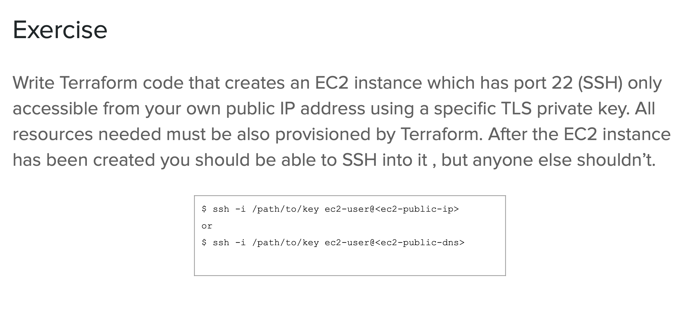
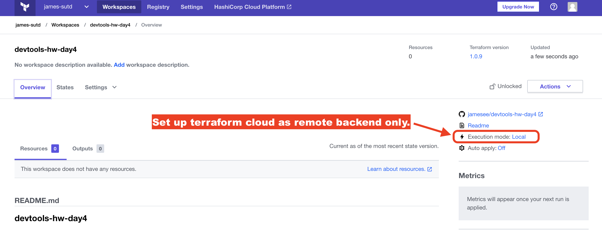
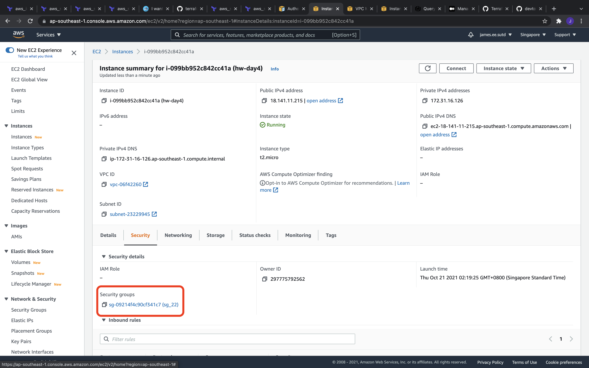
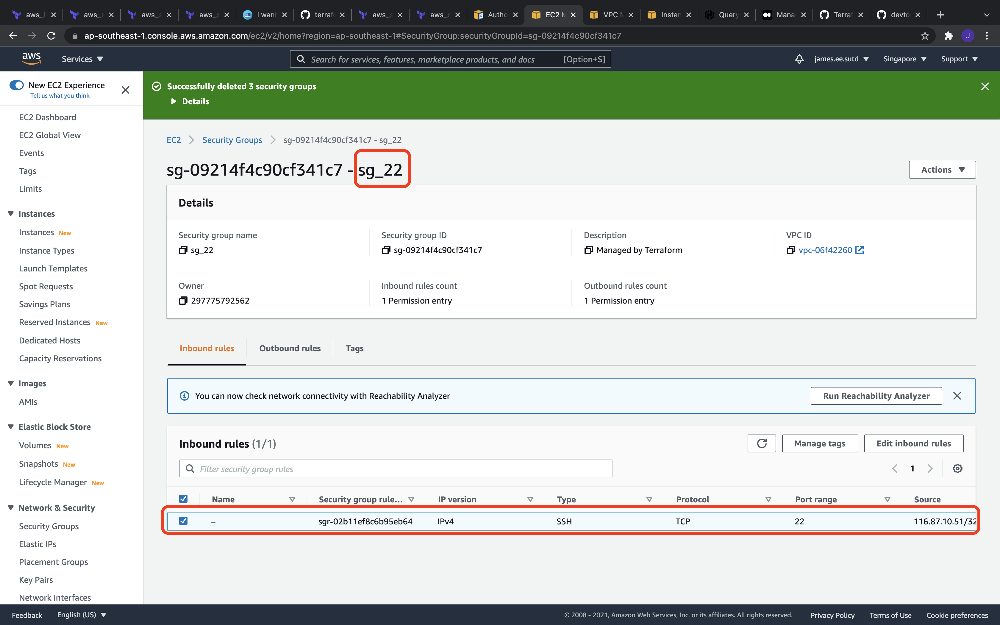

# DevTools Homework Day4




# Create AWS EC2 instance using Terraform

## Setup

```bash
$ terraform init

$ terraform plan

$ terraform apply
```

## Remote Backend via Terraform Cloud

Terraform cloud can be used for remote backend as well as running the terraform scripts at cloud.

In this homework exercise, Terraform Cloud is being setup as remote backend only to store the tfstate. The terraform scripts are executed locally. This is because the  **<u>own public ip address (myip)</u>** is generated dynamically using website http://ipv4.icanhazip.com for use to generate security group (sg_22) resource. If we run the terraform scripts remotely,**<u>myip</u>** will end up being Terraform Cloud's public ip address.




```bash
terraform {

  backend "remote" {
    organization = "james-sutd"

    workspaces {
      name = "devtools-hw-day4"
    }
  }

}

```

Login to terraform cloud
```bash
$ terraform login
```


## Clean Up

```bash
$ terraform destroy
```

# Results





